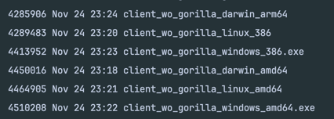

##  Mini-Soc-Clie (Minimalist Socket Client)

name inspired from 'miniscule'

Focus is to minimize a Golang binary for a client application

[Inspiration](https://hacktofinale.dyte.io/challenges/golf)

### Problem Statement

Develop a minimalistic client (in golang) using websocket to send a "hello" message to a server and print the server's response. The twist? Your goal is to make the executable binary as tiny as possible!

### Implementation

- Implemented a normal websocket server using gorilla library
- Also had created a client using gorilla 
- size was in 6 MBs
- Looked for ways to remove size
- First thing removing `fmt`
- Then gorilla
- so created a client with `golang.org/x/net/websocket`
- created a script to test with different flags, referred `Guide to decrease binary size in golang`

### Testing

To test it in your system:

- Clone the repo
- `go run server.go`
- `go run client.go`
- To determine size of client binary execute `./size_check.sh client_wo_gorilla.go`

### Requirements Gathering

[gfg article on socket programming in C++](https://www.geeksforgeeks.org/socket-programming-cc/)

[PPT on Socket & Network in C](https://www.csd.uoc.gr/~hy556/material/tutorials/cs556-3rd-tutorial.pdf)

[Tutorial on creating websocket in Go](https://yalantis.com/blog/how-to-build-websockets-in-go/)

#### Some resources for Golang

[Go by Examples](https://gobyexample.com/)

From the above articles it seems that sockets are like files, there's a protocol which they have to
follow to talk with each other, C has sockets library, there are some
standards which we have to adhere to, to be able to talk with server from client

[Profiling and benchmarking golang code blog](https://go.dev/blog/pprof)

This is a very good blog, details on how we can analyze where our memory is being consumed

[Paper on Benchmark of C++/Java/Go/Scala](https://research.google/pubs/pub37122/)

One more way to reduce Golang Binary size:
[Blog](https://gophercoding.com/reduce-go-binary-size/#:~:text=In%20short%2C%20adding%20the%20ldflags,commands%20like%20go%20tool%20nm%20.)

[Guide to decrease size of a binary in go](https://github.com/xaionaro/documentation/blob/master/golang/reduce-binary-size.md)

